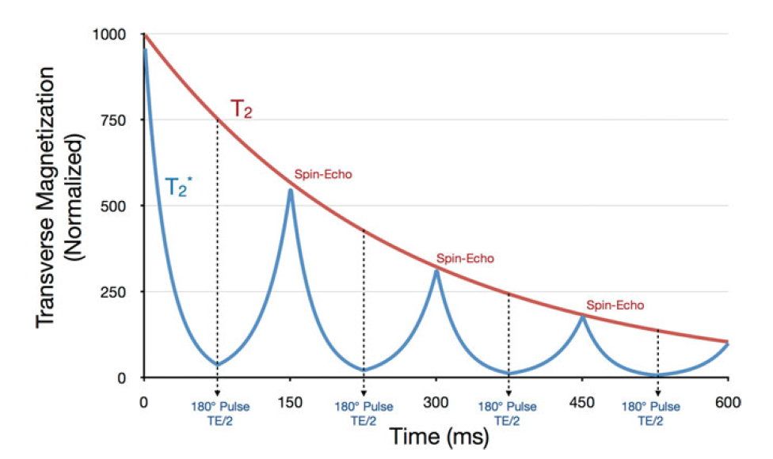
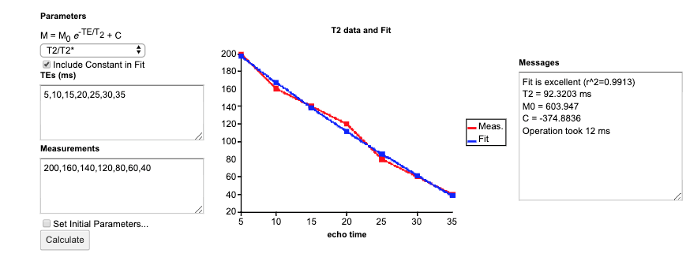
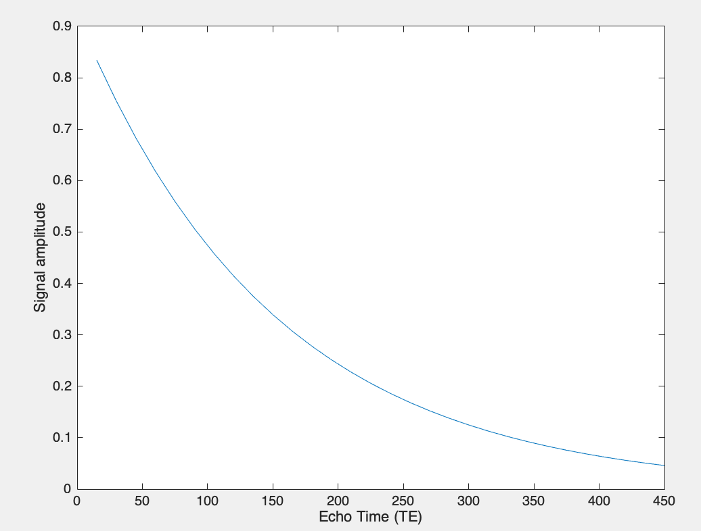

# NOTEBOOK PROJECT FORM: TEMPLATE

## GENERAL DESCRIPTION 
### Aim
Create a Jupyter Notebook that contains interactive objects visualizing data and/or performing code-based executions (e.g. a dashboard). 

### Type	
* [x] Educational document (i.e. interactive tutorial) 
* [ ] Supplementary material a published paper  
* [x] Research report 
  * [x] Includes data 
  * [x] Includes simulations
  * [x] Includes analytical equations 
  * [ ] Includes statistical analyses
  * [ ] Re-generates already existing figures 
  * [x] Makes use of open-source software 
  * [x] Makes use of open-source scripts

### Topic
Quantitative T2 mapping 

### Keywords 
Quantitative magnetic resonance imaging, Bloch simulation, exponential curve fitting, transverse relaxation time, transverse magnetization decay, T2 relaxation, fast spin-echo, turbo spin-echo 

### Suggested software/source code
* qMRLab (software): https://github.com/qMRLab/qMRLab/
  * Available as a Docker image qmrlab/octjn 
  * Examples available for configuration files 
* Bloch simulator (source code): http://mrsrl.stanford.edu/~brian/bloch/ 
  * Source codes can be included in the repo. Section B-2d) is highly relevant See the fsesignal.m. Note that the fsesignal.m has dependencies to sesignal.m, freeprecess.m, xrot.m and yrot.m which are provided by the same resource. 

### Contextually similar products

https://github.com/qMRLab/t1_notebooks

https://qmrlab.org/t1_book/intro 

https://qmrlab.org/2019/04/08/T1-mapping-mp2rage.html 

## BRIEF EXPLANATION   

### Introduction

Being one of the fundamental parameters explaining the behaviour of net magnetization in a nuclear magnetic resonance experiment, T2 is the time constant for decay of transverse magnetization (transverse component of the net magnetization). If you would like to find out more about T2, you can refer to this page.

For the sake of simplicity, T2 mapping can be seen as an exponential decay curve fitting problem, where each data point along the decay curve (red curve in the figure below) is sampled by employing a fast spin-echo sequence with multiple echo times (TE). 

T2 value is calculated by fitting one of the following signal expressions to the measured data. M is the signal amplitude, M0 describes a constant known as equilibrium magnetization and TE stands for echo time:

An additional constant term can be chosen (optional) to be included as a fitting term:  

Below is a snapshot from a web application that can perform T2 fitting http://www.mritoolbox.com/ParameterFitting.html

### Further reading 

## TENTATIVE EXPECTATIONS  

In qMRLab, there is a model available for T2 mapping that can generate synthetic data based on the model equation and perform T2 fitting with different options, which is a good fit for this project. Using this module and Bloch simulator (see the general description section): 

1. Create an interactive figure that shows multiple T2 decay curves (Transverse magnetization vs echo times [10ms to 200ms with 10ms increments]) for different anatomical structures in the brain (i.e. gray matter, white matter and cerebro-spinal fluid). You can refer to the available literature for T2 values in human brain at 3T.  You can use analytical signal expression to create these signal curves. 

2. Create an interactive figure that shows input image(s) on the left and the calculated map on the right panel. Use an interactive widget that allows user to toggle between input images. You can use qMRLab’s example dataset (xxxxx). Similar to the last interactive figure on this page https://qmrlab.org/t1_book/01/ir_blog/IR_DataFitting. 

3. Using simulation modules made available by qMRLab (see single voxel curve simulation), show T2 fitting accuracy against a range of signal to ratio (SNR) values within an interactive figure. As in (1), repeat the procedure for multiple T2 values (gray matter, white matter and csf) and overlay them in the same plot. 

4. Bonus: Create a simple dashboard (you can use plotly dash along with juypyter-plotly-dash (https://github.com/agahkarakuzu/datavis_edu) or multiple ipywidgets) similar to the one given above that allows users to choose between fitting options made available by qMRLab. Request multiple echo times and corresponding signal amplitudes as input, perform fitting, show fitted parameters and data vs fitted curve graph.  Hint: You can use SoS (https://vatlab.github.io/sos-docs/) or oct2py (https://pypi.org/project/oct2py/) to pass widget states/data between python and octave kernels. 

5. T2 fitting is typically performed by collecting data using a fast spin-echo (FSE) sequence at multiple echo times. In reality, these sequences involve multiple acquisition parameters other than just echo time, such as repetition time (TR) and flip angle. However, analytical signal expressions given above can’t account for the effect of these acquisition parameters on the signal. To achieve a more realistic signal that depends on multiple factors, Bloch equations are used. 

   Using the fsesignal.m  -a Bloch simulator for FSE sequence -, you can create simulated data, example use (this should give you enough hint): 

   * ETL = 30; (This is echo train length)
   * TE = 15;   (This is the time between echoes)
   * TR = 3000; (Repetition time)
   * T1= 1000; (T1 value set for the tissue)
   * T2 = 150;  (T2 value set for the tissue)
   * [Msig,~] = fsesignal(T1,T2,TE,TR,0,ETL);
   * plot(linspace(TE,TE*ETL,ETL),abs(Msig));
   * xlabel('Echo Time (TE)'); ylabel('Signal amplitude');

    

   Create an interactive figure (or a simple dashboard) that allows users to synthetically generate signals using Bloch equation. Plot the signal with respect to the echo times, fit data using qMRLab and overlay the fitted curve. You have the liberty to choose (or make user choose) which parameters are going to kept constant and which parameter(s) is/are going to be varied. For example, repeating the above example for a range of T1 parameters (on x-axis) and showing fitted T2 values (y-axis) for a fixed T2 value would be really cool. Use your creativity to do even more!      

## YOUR REPOSITORY MUST HAVE 
* LICENSE 
* README
* Configuration files or Dockerfile 
* Binder badge
* .gitignore
* … 

## YOUR REPOSITORY SHOULD NOT HAVE 
* Binary data (simple png files etc are OK) 
* Output html figures > 1MB 

You can upload such files to a public OSF repo (having the exact same name with your GitHub repo) and download them to your environment. 

## TO BE FILLED OUT BY THE NOTEBOOK CREATOR 

**Name and Surname:** 

**GitHub username:** @... 

**GitHub repository where the notebook is hosted:**  .../...

**Links to the external resources:** 
* Link-1 (e.g. to an open source software installed in the environment) 
* Link-2 (e.g. to source codes included in the environment) 

**Environment is resolved by:** 
* Configuration files 
* Dockerfile 

* **Fill out the following section if you used data in your project** * 

**Data type:**

**Data size:** 
 
**Link to the data:**
